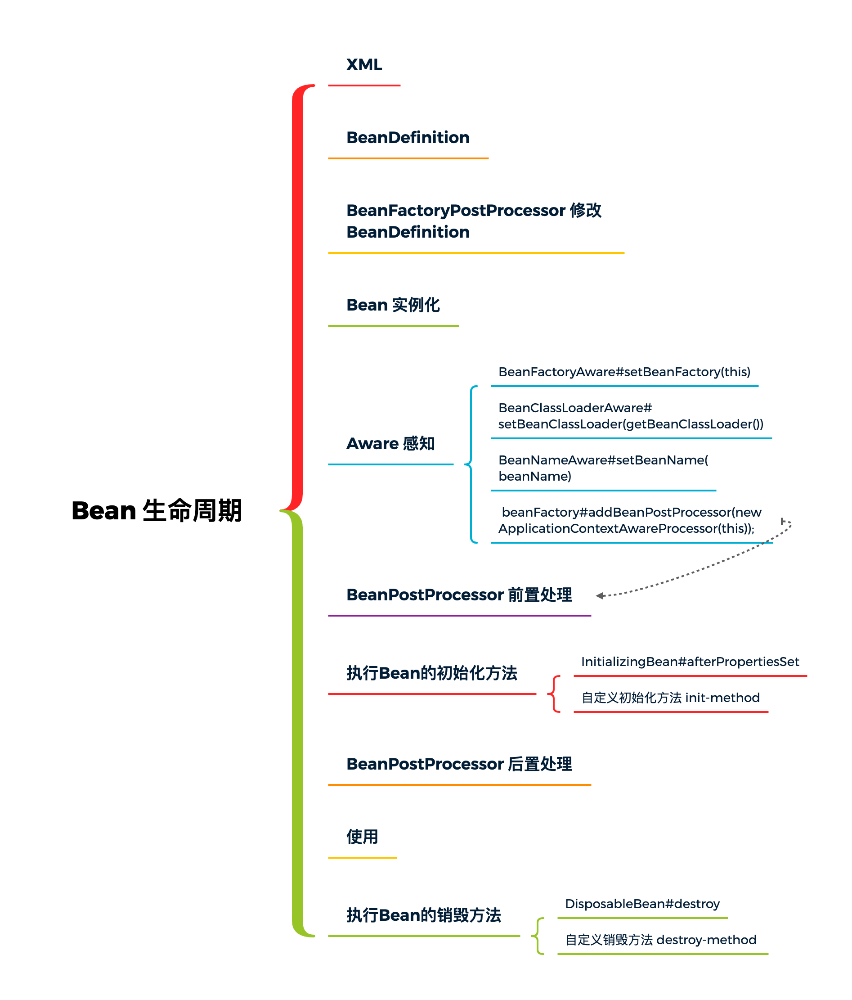
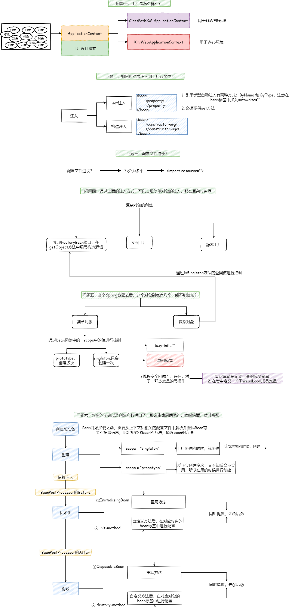
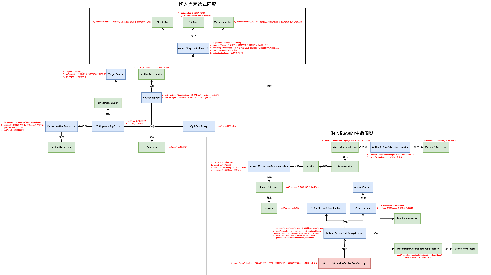
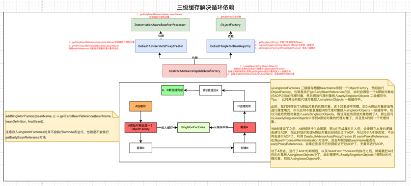

# mini-spring

**手写spring：从0开始手写一个spring框架**

   
 

## 简介

本项目是一个手写spring框架的项目，从0开始手写一个spring框架，实现spring的基本功能，包括IOC、DI、AOP、MVC等功能。

项目分为两部分：

- mini-spring-original：通过30个类来实现spring的基本功能，功能简洁实用，可以浅显易懂理解spring的DI、IOC、AOP、MVC等功能。参考自[《Spring 5核心原理与30个类手写实战》](https://book.douban.com/subject/34466260/)
- mini-spring-iteration: 符合spring源码风格的spring框架，参照源码，通过分治、抽象和知识(设计模式、设计原则)实现了spring的基本功能，包括IOC、DI、AOP等功能。参考自[《手写Spring：渐进式源码实践》](https://book.douban.com/subject/36139432/)

 

    
    

 

> 代码均有注释，可以参照下面的图片和对应代码进行spring的理解与学习

## Bean的生命周期

## Spring类加载全流程

## Spring IoC的类图

## Spring AOP的类图

## Spring 三级缓存解决循环依赖
